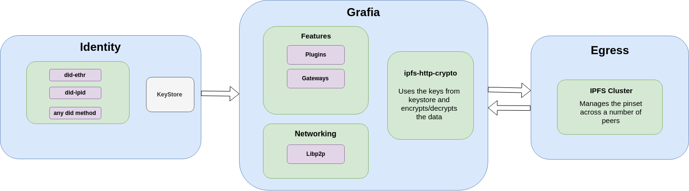

# Grafia

An easy-to-use, hackable web interface for [IpfsCloud](https://ipfsclous.store)

## Lead Maintainer

[Vaibhav Saini](https://github.com/vasa-develop)

## Stack Used

* React (UI Library)
* Redux (Application State Management)

For more details on Stack, see [Architecture](#Architecture)

## Architecture

*Disclaimer: The Architecture is subject to major changes*

### Identity

**A modular component which manages the identity of the user. This identity is not limited to the application.**

The identity of a user is managed by the use of [DIDs](https://w3c-ccg.github.io/did-spec/)(Decentralized Identities). Any DID that conforms with [W3C DID Spec](https://w3c-ccg.github.io/did-spec/) can be used to manage identity of a user on this platform.

### [Grafia](https://github.com/cluster-labs/egress)

**A modular, configurable UI interface for interacting with data over [IPFS](https://ipfs.io).**

It has following features:
* An Interface to manage the data.
* Support for multiple gateways(local & remote).
* A modular networking module using [Libp2p](https://libp2p.io) for peer-to-peer communtication between the clients.
* A library([ipfs-http-crypto](https://github.com/cluster-labs/ipfs-http-crypto)) for encrypting/decrypting data while exhanging data from a local/remote IPFS gateway. We are also working on [ipfs-cluster-crypto](https://github.com/cluster-labs/ipfs-cluster-crypto) to enable encryption/decryption while exchanging data with a [IPFS Cluster](https://cluster.ipfs.io)
* We also plan to add a marketplace of plugins/apps which can leverage this interface. These apps will be listed in the apps section, and can be used within the interface.

### [Egress](https://github.com/cluster-labs/egress)

**A configurable, monitorable IPFS Cluster Implementation with GUI interface to manage the nodes.**

See [here](https://github.com/cluster-labs/egress) for more details on Egress.
